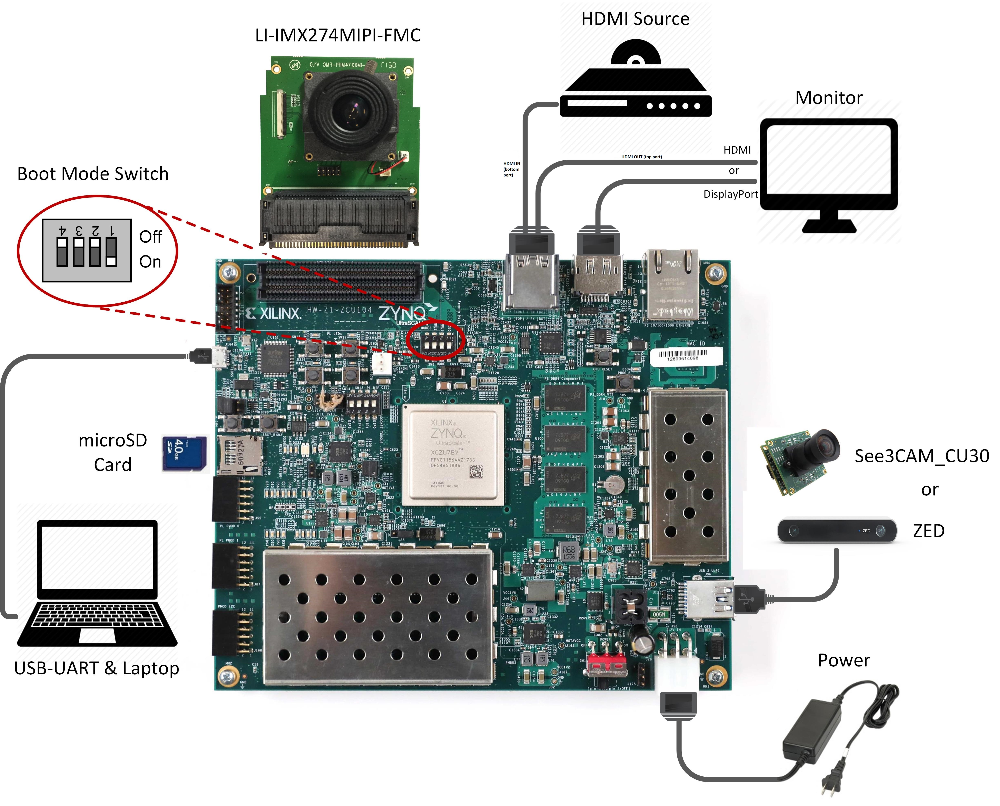
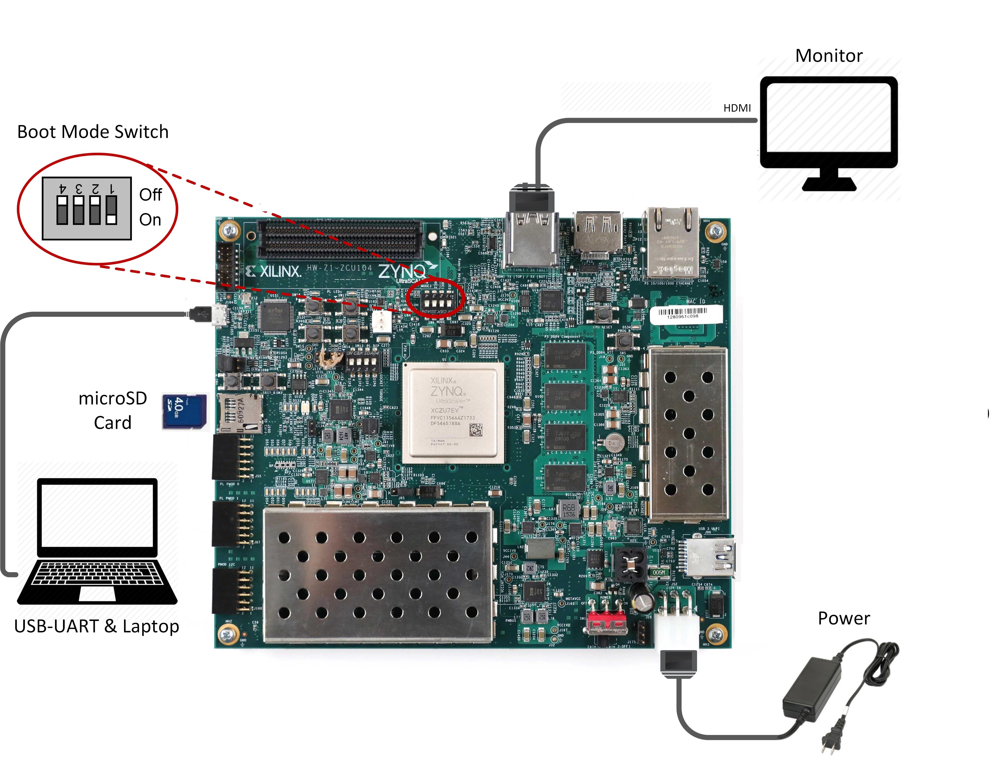
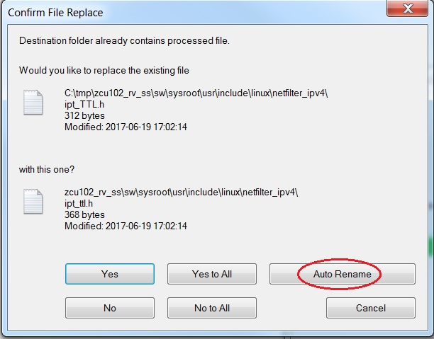

            Read this page in other languages:<a href="../docs-jp/Docs/operating-instructions.md">日本語</a>    <table style="width:100%"><table style="width:100%">
  <tr>

<th width="100%" colspan="6"><h1>reVISION Getting Started Guide 2018.3 (UG1265)</h1>
</th>

  </tr>
  <tr>
    <td width="17%" align="center"><a href="../README.md">1. Introduction</a></td>
    <td width="16%" align="center"><a href="overview.md">2. Overview</a></td>
    <td width="17%" align="center"><a href="software-tools-system-requirements.md">3. Software Tools and System Requirements</a></td>
    <td width="17%" align="center"><a href="design-file-hierarchy.md">4. Design File Hierarchy</a></td>
</tr>
<tr>
    <td width="17%" align="center">5. Installation and Operating Instructions</td>
    <td width="16%" align="center"><a href="tool-flow-tutorials.md">6. Tool Flow Tutorials</a></td>
    <td width="17%" align="center"><a href="run-application.md">7. Run the Application</a></td>
    <td width="17%" align="center"><a href="platform-details.md">8. Platform Details</a></td>    
  </tr>
<tr>
    <td width="17%" align="center" colspan="2"><a href="known-issues-limitations.md">9. Known Issues and Limitations</a></td>
    <td width="16%" align="center" colspan="2"><a href="additional-references.md">10. Additional References</a></td>
</tr>
</table>

# 5. Installation and Operating Instructions

## 5.1. Board Setup
### 5.1.1. Single Sensor Setup

##### 5.1.1.1. Required Actions
* Connect the power supply to the 12V power connector.
* Display options:
  * Connect a DisplayPort cable to DisplayPort connector on the board; connect the other end to a monitor, _or_
  * Connect an HDMI cable to the HDMI output (*top* HDMI connector) on the board; connect the other end to a monitor.

**:warning: WARNING** Make sure you only connect _either_ the DisplayPort _or_ the HDMI output to the board, not both. Otherwise, the design might malfunction.

**:pushpin: NOTE** Certain monitors have multiple HDMI ports supporting different HDMI standards. Make sure you choose an HDMI 2.0 capable port (if available) for 4k60 performance.

* Connect the Micro USB cable to the USB-UART connector; use the following settings for the terminal emulator:
  * Baud Rate: 115200
  * Data: 8 bit
  * Parity: None
  * Stop: 1 bit
  * Flow Control: None

* Insert an SD card (FAT formatted) with pre-built images copied from one of the following directories:
  * `sd_card/optical_flow`
  * `sd_card/stereo`
  * `sd_card/filter2d`
  * `sd_card/triple`

##### 5.1.1.2. Optional Actions
* Connect an HDMI cable to the HDMI input (_bottom_ HDMI connector) on the board; connect the other end to an HDMI source.
* Connect the See3CAM_CU30 or ZED USB camera to the USB3 Micro AB connector using the Xilinx USB3 Micro B adapter.
* Connect the LI-IMX274MIPI-FMC module to the FMC connector on the board (use the HPC0 connector on the ZCU102).

  **:pushpin: NOTE** VADJ needs to be set to **1.2V** for the correct operation of the daughter card. If the FMC card does not function, please follow the instructions explained in Answer Record [AR67308](https://www.xilinx.com/support/answers/67308.html) for rev 1.0 and beyond to check and/or set VADJ.

#### 5.1.1.3. ZCU102 Jumpers and Switches
* Set the boot mode to the SD card:
  * SW6[4:1]: **off, off, off, on**
* Configure the USB jumpers for host mode. The diagram shows the area on the board near the USB connector.
  * J110: **2-3**
  * J109: **1-2**
  * J112: **2-3**
  * J7: **1-2**
  * J113: **1-2**

  

#### 5.1.1.4. ZCU104 Jumpers & Switches
* Set the boot mode to the SD card:
  * SW6[4:1]: **off, off, off, on**

  

### 5.1.2. 8-Stream VCU + CNN Setup

#### 5.1.2.1. Required Actions
* Connect the power supply to the 12V power connector.
* For the display, connect an HDMI cable to the HDMI output (_top_ HDMI connector) on the board; connect the other end to a monitor.
* Connect the micro USB cable to the USB-UART connector; use the following settings for the terminal emulator:
  * Baud Rate: 115200
  * Data: 8 bit
  * Parity: None
  * Stop: 1 bit
  * Flow Control: None
* Insert an SD card (FAT formatted) with pre-built images from the `sd_card` directories.

#### 5.1.2.2. ZCU104 Jumpers and Switches
* Set the boot mode to the SD card:
  * SW6[4:1]: **off, off, off, on**

  

## 5.2. Extracting the Design Files

Download and unzip the reference design .zip file matching your silicon version (see [Software](software-tools-system-requirements.md#32-software)).
* For Linux, use the `unzip` utility.
* For Windows, make sure that the reference design .zip file is unzipped in a directory path which contains no spaces. Use the 7zip utility and follow the steps below. You can download 7zip [here](http://www.7-zip.org/).

**:pushpin: NOTE** When prompted to confirm the file replace, select **Auto Rename** (Windows only).

  

:arrow_forward:**Next Topic:**  [6. Tool Flow Tutorials](tool-flow-tutorials.md)

:arrow_backward:**Previous Topic:**  [4. Design File Hierarchy](design-file-hierarchy.md)

Copyright&copy; 2018–2019 Xilinx

