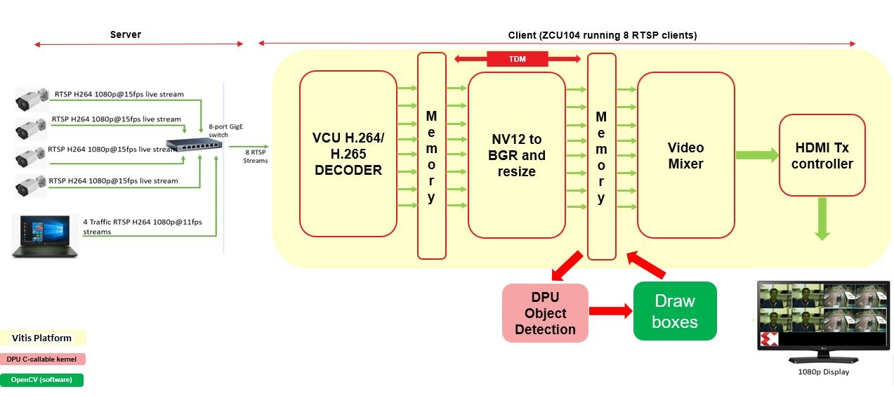
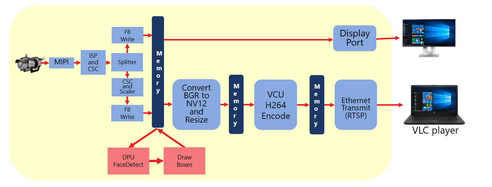



            Read this page in other languages:<a href="../docs-jp/Docs/overview.md">日本語</a>    <table style="width:100%">
  <tr>

<th width="100%" colspan="6"><h1>Vitis Software Platform: Embedded Vision Reference Platforms User Guide 2019.2 (UG1265)</h1>
</th>

  </tr>
  <tr>
    <td width="17%" align="center"><a href="../README.md">1. Introduction</a></td>
    <td width="16%" align="center">2. Overview</td>
    <td width="17%" align="center"><a href="software-tools-system-requirements.md">3. Software Tools and System Requirements</a></td>
    <td width="17%" align="center"><a href="design-file-hierarchy.md">4. Design File Hierarchy</a></td>
</tr>
<tr>
    <td width="17%" align="center"><a href="operating-instructions.md">5. Installation and Operating Instructions</a></td>
    <td width="16%" align="center"><a href="tool-flow-tutorials.md">6. Tool Flow Tutorials</a></td>
    <td width="17%" align="center"><a href="run-application.md">7. Run the Application</a></td>
    <td width="17%" align="center"><a href="platform-details.md">8. Platform Details</a></td>    
  </tr>
<tr>
    <td width="17%" align="center" colspan="2"><a href="known-issues-limitations.md">9. Known Issues and Limitations</a></td>
    <td width="16%" align="center" colspan="2"><a href="additional-references.md">10. Additional References</a></td>
</tr>
</table>

# 2. Overview

Hardware designs for the Vitis™ software platform consist of an embedded processor block along with Xilinx IPs for video reception, transmission, decoding, encoding, and processing capabilities. These hardware designs are similar to earlier vision platforms used with SDSoC tools. 

#### Single Sensor Demo Design

The following figure shows a block diagram of the Single Sensor design. Video sources (or capture pipelines) are shown on the left. Computer vision accelerators implemented as memory-to-memory (m2m) pipelines are shown in the middle (filter2D, stereo vision, and optical flow). Video sinks (or output/display pipelines) are shown on the right. This design is available on the ZCU104 board only.

#### 8-Stream VCU + CNN Demo Design

The following figure shows a block diagram of the 8-Stream VCU + CNN design. An 8-stream video data flow is shown. The received streams are decoded using the Xilinx Video Codec Unit (VCU) IP. Color space conversion and scaling is done in a time division multiplexing (TDM) manner using Xilinx video processing IPs. Machine learning (ML) is applied on received video data for both traffic detect and face detect functions using the Xilinx Deep Learning Processor Unit (DPU) IP as an accelerator, and the output streams are mixed to display on an HDMI monitor using the Xilinx HDMI Tx Subsystem IP. This design is available on the ZCU104 board only.

#### Smart Camera Demo Design

The following figure shows a block diagram of the Smart Camera design. The captured frames are processed by ISP and broadcast over two ports. One stream is played out on DP without any further processing, and machine learning (ML) is applied on the second stream using the Xilinx Deep Learning Processor Unit (DPU) IP as an accelerator before it is sent over the network. This design is available on the ZCU104 board only.

## 2.1. Platforms

### 2.1.1. Single Sensor Platform

The ZCU104 Single Sensor platform supports the following video interfaces.

#### 2.1.1.1. Sources

  - USB2/3 camera up to 1080p60 or stereo 1080p30
    - The USB controller is part of the processing system (PS). It uses the standard Linux Universal Video Class (UVC) driver.
  - HDMI RX up to 4k60
    - The HDMI capture pipeline is implemented in the programmable logic (PL) and consists of the HDMI RX Subsystem, the Video Processing Subsystem (Scaler-only configuration), and the Frame Buffer Write IP. The HDMI RX Subsystem receives and decodes the HDMI data stream from an HDMI source and converts it to AXI4-Stream. The Video Processing Subsystem converts the incoming color format (RGB, YUV444, or YUV422) to YUV422 and optionally scales the image to the target resolution. The Frame Buffer Write IP writes the YUV422 stream to memory as packed YUYV format. The HDMI capture pipeline uses the V4L Linux framework.
  - MIPI CSI using an optional FMC card up to 4k60
    - The MIPI capture pipeline is implemented in the PL and consists of the Sony IMX274 image sensor, the MIPI CSI2 Subsystem, the Demosaic IP, the Gamma IP, the Video Processing Subsystem (CSC configuration), a Video Processing Subsystem (Scaler-only configuration), and the Frame Buffer Write IP. The IMX274 image sensor provides raw image data over the camera sensor interface (CSI) link. The MIPI CSI2 Subsystem receives and decodes the incoming data stream to AXI4-Stream. The Demosaic IP converts the raw image format to RGB. The Gamma IP provides per-channel gamma correction functionality. The VPSS-CSC provides color correction functionality. The VPSS-Scaler converts the RGB image to YUV422. The Frame Buffer Write IP writes the YUV422 stream to memory as packed YUYV format. The MIPI capture pipeline uses the V4L Linux framework.

#### 2.1.1.2. Sinks
* HDMI TX up to 4k60
  * The HDMI display pipeline is implemented in the PL and consists of the Video Mixer IP and the HDMI TX Subsystem. The Video Mixer is configured to read one ARGB and two YUYV layers from memory. In the provided design examples, only a single YUYV layer is used. The video layers are then composed and alpha-blended into a single output frame which is sent to the HDMI TX Subsystem using AXI4-Stream. The HDMI TX Subsystem encodes the incoming video into an HDMI data stream and sends it to the HDMI display. The HDMI display pipeline uses the DRM/KMS Linux framework.
* DP TX up to 4k30
   * The DP display pipeline is configured for dual-lane mode, and is part of the PS. It includes a simple two-layer blender with run-time programmable color format converters per layer. The two layers are always full screen, matching the target display resolution. The DP display pipeline uses the DRM/KMS Linux framework.

### 2.1.2. 8-Stream VCU + CNN Platform

   The ZCU104 8-stream VCU + CNN platform supports the following video interfaces.

#### 2.1.2.1. Sources
   The sources can be either of the following. In either case, all 8 streams should be H.264/H.265 encoded:
   * Four IP camera traffic streams and four streams from a laptop
   * 8 streams from the laptop alone (H.264/H.265 encoded File I/O)

#### 2.1.2.2. Sinks
   * HDMI TX
     * The HDMI display pipeline is implemented in the PL and consists of the Video Mixer IP and the HDMI TX Subsystem. The Video Mixer IP is configured to read one ARGB and eight BGR layers from memory. Each layer of mixer takes data dumped by DeePhi after machine learning and shows it over HDMI after mixing.

### 2.1.3. ZCU104 Smart Camera Platform

The ZCU104 Smart Camera platform supports the following video interfaces.

#### 2.1.3.1. Sources
   * MIPI camera
     * The MIPI capture is implemented in the PL. This consists of the [MIPI CSI-2 Receiver subsystem](https://www.xilinx.com/products/intellectual-property/ef-di-mipi-csi-rx.html), ISP, a color space converter, a broadcaster, and a scaler. Using the broadcaster, the captured stream is displayed on DisplayPort and simultaneously processed for ML using DeePhi DNNDK.

#### 2.1.3.2. Sinks
   * DisplayPort and Ethernet
     * The DisplayPort and Ethernet are PS components. GStreamer plugins are used to send the machine learning or stream data either to the DisplayPort, or over Ethernet.

## 2.2. Design Examples

### 2.2.1. Single Sensor Demo Design

The following examples show how to build and run the various computer vision accelerators on input and output live video.

* Dense Optical Flow
  * Requires LI-IMX274MIPI-FMC _or_ HDMI source _or_ a See3CAM_CU30 USB camera.
   * This algorithm uses two successive images in time, and calculates the direction and magnitude of motion at every pixel position in the image. The calculation is a simple implementation of the Lucas–Kanade method for optical flow estimation. The optical flow algorithm returns two signed numbers at each pixel position, representing up or down motion in the vertical direction, and left or right motion in the horizontal direction. The brightness of the false-color output, from black up to bright color, indicates the magnitude of the motion, and the color indicates the direction.

* Stereo Vision (Depth Detection)
  * Requires a ZED USB stereo camera.
  * This algorithm uses two side-by-side images from the stereo camera taken at the same moment in time, and calculates the depth, or distance from the camera, at every pixel position in the image. The stereo block-matching algorithm calculates depth based on binocular parallax, similar to the way human eyes perceive depth. The depth map is coded in false colors. Objects that are the furthest away appear deep blue. Closer objects appear in rainbow succession: green, yellow, orange, red, purple and finally white, closest to the camera.

* Filter2D
  * Requires LI-IMX274MIPI-FMC _or_ HDMI source _or_ a See3CAM_CU30 USB camera.
   * Convolution is a common image processing technique that changes the intensity of a pixel to reflect the intensities of the surrounding pixels. This is widely used in image filters to achieve popular image effects like blur, sharpen, and edge detection. The implemented algorithm uses a 3x3 kernel with programmable filter coefficients.

The following table shows the performance matrix of the live I/O samples on the supported platforms:

| Sample  | **ZCU104** |
|----|----|
| filter2d | 2160p30 |
| optical_flow | 2160p30 |
| stereo | 720p30 |

### 2.2.2. 8-Stream VCU + CNN Demo Design

This design performs the VCU decode of the H.264/H.265 streams and passes the decoded streams to the DeePhi DNN Processing Unit (DPU) IP for machine learning. The example provided performs face detection on four input streams, and traffic detection on another four input streams. Face detection is shown by boxes encircling detected faces. Traffic detection and classification are shown by a different color of box encircling pedestrians, cars, and cycles.

The decoded output of the VCU is NV12, and the input for the DPU IP is BGR. The resolution for DNN is 480x360, which might be different from the actual file; a VPSS subsystem is present in the design in order to perform color space conversion and downscaling. The following table shows the performance matrix for this platform.

| Number of Parallel Streams | FPS per Stream (face detect) | FPS per Stream (traffic detect) |
|----|----|----|
| 8 | 24.8 | 11.8 |
| 7 | 28 | 12.7  |
| 6 | 33 | 14.8 |
| 4 | 45 | 22.3 |
| 2  | 57 | 29 |
| 1  | 60  | 30 |

**:pushpin: Note:**
This solution uses the DNNDK libraries. The same solution can be ported to use the Vitis AI libraries as well. Refer to the Vitis AI User Guide ([UG1414](https://www.xilinx.com/support/documentation/sw_manuals/vitis_ai/1_0/ug1414-vitis-ai.pdf)) and the Vitis AI Library User Guide ([UG1354](https://www.xilinx.com/support/documentation/user_guides/ug1354-xilinx-ai-sdk.pdf)) for more information.

### 2.2.3. ZCU104 Smart Camera Demo Design

For the ZCU104 Smart Camera platform, there are two design examples: one uses Xilinx ISP, and the other uses Regulus ISP. The design with Regulus ISP is available only in bitstream format for evaluation. The same Xilinx ISP hardware design can be reused to create the design with Regulus ISP by replacing the Xilinx ISP IP components (Gamma and Demosaic) with the Regulus ISP4K IP component. Contact [Regulus](http://www.reglus.co.jp/english/top_en/#ISP4K) for the Regulus ISP4K IP and for information on integrating it with the design. Frames are captured using the MIPI sensor and the captured data is processed by the ISP. The broadcaster/splitter takes the captured stream as input, and outputs two parallel streams on two different ports. One stream can be displayed on the DisplayPort without any processing, or can be encoded by the video codec unit (VCU) and transmitted over a network. The other stream output from the broadcaster is converted to BGR and scaled down by the [Multi-Scaler IP core](https://www.xilinx.com/products/intellectual-property/v-multi-scaler.html) (as required by the DPU IP) for ML processing. The ML demo used with this platform is facedetect. Other ML processing can be done by modifying the demo script and using the necessary DPU libraries. The output from the ML processing is in BGR format, and the Multi-Scaler IP is used to convert the color format to NV12. The output of the Multi-Scaler IP is then encoded using VCU in H.264 format and transmitted as an RTSP stream using GStreamer plugins.

Currently, the design is configured to use only one channel of the VCU. Consequently, only one stream (either the ML-processed stream or the original stream without ML) can be encoded for a single run. To enable simultaneous streams, the design needs to be modified to support multiple streams in the VCU IP.

The following table shows the performance matrix for this platform.

| Number of Parallel Streams | FPS per Stream |
|----|----|
| 1  | 42.7  |

The following table shows the resource usage for the Regulus ISP design:

| Name | CLB LUTs | CLB Registers | CLB | LUT as Logic | LUT as Memory | Block RAM Tile | URAM | DSPs |
|---------------------------------------------------------------------------|----------|---------------|-------|--------------|---------------|----------------|------|------|
| Total available resources in ZCU104 | 230400 | 460800 | 28800 | 230400 | 101760 | 312 | 96 | 1728 |
| Total used by zcu104_smart_camera | 123035 | 193265 | 26387 | 112373 | 10662 | 195.5 | 57 | 977 |
| dpu_top_1 (machine learning IP built using the Vitis software platform) | 55301 | 55301 | 13768 | 50091 | 5210 | 84.5 | 46 | 562 |
| MIPI capture pipeline total | 49111 | 60935 | 10551 | 45312 | 3799 | 71.5 | 11 | 325 |
| axis_broadcaster_0 (zcu104_smart_camera_axis_broadcaster_0_0) | 4 | 2 | 1 | 4 | 0 | 0 | 0 | 0 |
| isp4k_0 (Regulus ISP) | 33357 | 38111 | 6636 | 30454 | 2903 | 24 | 11 | 276 |
| mipi_csi2_rx_subsystem_0 (zcu104_smart_camera_mipi_csi2_rx_subsystem_0_0) | 2893 | 3889 | 861 | 2819 | 74 | 8 | 0 | 0 |
| v_frmbuf_wr_0 (zcu104_smart_camera_v_frmbuf_wr_0_0) | 2368 | 4091 | 638 | 2065 | 303 | 6 | 0 | 1 |
| v_frmbuf_wr_1 (zcu104_smart_camera_v_frmbuf_wr_1_0) | 2332 | 3628 | 556 | 2045 | 287 | 4 | 0 | 2 |
| v_proc_ss_0 (zcu104_smart_camera_v_proc_ss_0_0) | 2369 | 2822 | 595 | 2367 | 2 | 7 | 0 | 18 |
| v_proc_ss_1 (zcu104_smart_camera_v_proc_ss_1_0) | 5394 | 7296 | 1235 | 5246 | 148 | 17.5 | 0 | 28 |
| sensor_iic_0 (zcu104_smart_camera_sensor_iic_0_0) | 383 | 357 | 69 | 365 | 18 | 0 | 0 | 0 |
| v_multi_scaler_0 (zcu104_smart_camera_v_multi_scaler_0_0) | 8863 | 13034 | 2254 | 7734 | 1129 | 31 | 0 | 90 |
| vcu_0 (hardened block in PL) | 93 | 33 | 33 | 93 | 0 | 0 | 0 | 0 |

The following table shows the resource usage for the Xilinx ISP design:

| Name | CLB LUTs | CLB Registers | CLB | LUT as Logic | LUT as Memory | Block RAM Tile | URAM | DSPs |
|---------------------------------------------------------------------------|----------|---------------|-------|--------------|---------------|----------------|------|------|
| Total available resources in ZCU104 | 230400 | 460800 | 28800 | 230400 | 101760 | 312 | 96 | 1728 |
| Total used by zcu104_smart_camera | 96371 | 161584 | 22378 | 88529 | 7842 | 197.5 | 46 | 717 |
| dpu_top_1 (machine learning IP built using the Vitis software platform) | 55305 | 104242 | 14051 | 50095 | 5210 | 84.5 | 46 | 562 |
| MIPI capture pipeline total | 22443 | 29654 | 5504 | 21464 | 979 | 73.5 | 0 | 65 |
| axis_broadcaster_0 (zcu104_smart_camera_axis_broadcaster_0_0) | 4 | 2 | 2 | 4 | 0 | 0 | 0 | 0 |
| mipi_csi2_rx_subsystem_0 (zcu104_smart_camera_mipi_csi2_rx_subsystem_0_0) | 2879 | 3865 | 755 | 2805 | 74 | 8 | 0 | 0 |
| v_demosaic_0 (zcu104_smart_camera_v_demosaic_0_0) | 5894 | 5588 | 1187 | 5811 | 83 | 20 | 0 | 16 |
| v_frmbuf_wr_0 (zcu104_smart_camera_v_frmbuf_wr_0_0) | 2369 | 4091 | 626 | 2066 | 303 | 6 | 0 | 1 |
| v_frmbuf_wr_1 (zcu104_smart_camera_v_frmbuf_wr_1_0) | 2331 | 3628 | 615 | 2044 | 287 | 4 | 0 | 2 |
| v_gamma_lut_0 (zcu104_smart_camera_v_gamma_lut_0_0) | 789 | 1227 | 230 | 789 | 0 | 6 | 0 | 0 |
| v_proc_ss_0 (zcu104_smart_camera_v_proc_ss_0_0) | 2390 | 2870 | 587 | 2388 | 2 | 7 | 0 | 18 |
| v_proc_ss_1 (zcu104_smart_camera_v_proc_ss_1_0) | 5396 | 7287 | 1411 | 5248 | 148 | 17.5 | 0 | 28 |
| sensor_iic_0 (zcu104_smart_camera_sensor_iic_0_0) | 380 | 357 | 79 | 362 | 18 | 0 | 0 | 0 |
| v_multi_scaler_0 (zcu104_smart_camera_v_multi_scaler_0_0) | 8861 | 13034 | 2325 | 7732 | 1129 | 31 | 0 | 90 |
| vcu_0 (hardened block in PL) | 93 | 33 | 37 | 93 | 0 | 0 | 0 | 0 |

:arrow_forward:**Next Topic:**  [3. Software Tools and System Requirements](software-tools-system-requirements.md)

:arrow_backward:**Previous Topic:**  [1. Introduction](https://github.com/Xilinx/TechDocs/tree/reVISION-getting-started-develop/README.md)

Copyright&copy; 2018–2019 Xilinx

