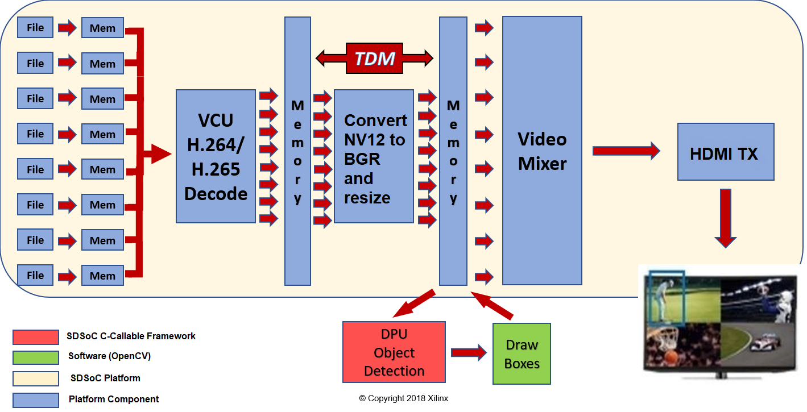

            別の言語で表示: <a href="../../Docs/overview.md">英語</a>    <table style="width:100%">
  <tr>

<th width="100%" colspan="6"><h1>reVISION 入門ガイド 2018.3 (UG1265)</h1>
</th>

  </tr>
  <tr>
    <td width="17%" align="center"><a href="../README.md">1. はじめに</a></td>
    <td width="16%" align="center">2. 概要</td>
    <td width="17%" align="center"><a href="software-tools-system-requirements.md">3. ソフトウェア ツールおよびシステム要件</a></td>
    <td width="17%" align="center"><a href="design-file-hierarchy.md">4. デザイン ファイルの階層</a></td>
</tr>
<tr>
    <td width="17%" align="center"><a href="operating-instructions.md">5. インストールおよび操作手順</a></td>
    <td width="16%" align="center"><a href="tool-flow-tutorials.md">6. ツール フロー チュートリアル</a></td>
    <td width="17%" align="center"><a href="run-application.md">7. アプリケーションの実行</a></td>
    <td width="17%" align="center"><a href="platform-details.md">8. プラットフォームの詳細</a></td>    
  </tr>
<tr>
    <td width="17%" align="center" colspan="2"><a href="known-issues-limitations.md">9. 既知の問題および制限</a></td>
    <td width="16%" align="center" colspan="2"><a href="additional-references.md">10. その他のリソース</a></td>
</tr>
</table>

# 2. 概要

次の図に、reVISION シングル センサー デザインのブロック図を示します。ビデオ ソース (キャプチャ パイプライン) は左側に青で示します。M2M (Memory-to-Memory) パイプラインとしてインプリメントされているコンピューター ビジョン アクセラレータは中央に赤で示します。ビデオ シンク (出力/ディスプレイ パイプライン) は右側に緑で示します。

次の図に、reVISION 8 ストリーム VCU + CNN デザインのブロック図を示します。時分割多重化 (TDM) を使用する 8 ストリーム フローを示します。このデザインは、ZCU104 ボードでのみ使用可能です。

## 2.1. プラットフォーム

### 2.1.1. シングル センサー プラットフォーム

ZCU102/ZCU104 シングル センサー reVISION プラットフォームでは、次のビデオ インターフェイスがサポートされています。

#### 2.1.1.1. ソース

  - 1080p60 までの USB2/3 カメラまたはステレオ 1080p30
    - USB コントローラーは、プロセッシング システム (PS) の一部です。標準の Linux ユニバーサル ビデオ クラス (UVC) ドライバーを使用します。
  - 4k60 までの HDMI RX
    - HDMI キャプチャ パイプラインはプログラマブル ロジック (PL) にインプリメントされ、HDMI RX Subsystem、Video Processing Subsystem (Scaler のみの構成)、および Frame Buffer Write で構成されます。HDMI RX Subsystem は、HDMI ソースから HDMI データ ストリームを受信してデコードし、AXI4-Stream に変換します。Video Processing Subsystem は、入力の色フォーマット (RGB、YUV444、または YUV422) から YUV422 に変換し、オプションで画像をターゲットの解像度にスケーリングします。Frame Buffer Write IP は、YUV422 ストリームをパック形式の YUYV フォーマットとしてメモリに書き込みます。HDMI キャプチャ パイプラインは、V4L Linux フレームワークを使用します。
  - 4k60 までのオプションの FMC カードを使用した MIPI CSI
    - MIPI キャプチャ パイプラインは PL にインプリメントされ、ソニー IMX274 イメージ センサー、MIPI CSI2 Subsystem、Demosaic IP、Gamma IP、Video Processing Subsystem (CSC 構成)、Video Processing Subsystem (Scaler のみの構成)、および Frame Buffer Write IP で構成されます。IMX274 イメージ センサーは、カメラ センサー インターフェイス (CSI) リンクを介して Raw 画像データを供給します。MIPI CSI2 Subsystem は、入力データ ストリームを受信してデコードし、AXI4-Stream に変換します。Demosaic IP は、Raw 画像フォーマットを RGB に変換します。Gamma IP は、チャネルごとのガンマ補正を実行します。VPSS-CSC は、色補正を実行します。VPSS Scaler は、RGB 画像を YUV422 に変換します。Frame Buffer Write IP は、YUV422 ストリームをパック形式の YUYV フォーマットとしてメモリに書き込みます。MIPI キャプチャ パイプラインは、V4L Linux フレームワークを使用します。

#### 2.1.1.2. シンク
* 4k60 までの HDMI TX
  * HDMI ディスプレイ パイプラインは PL にインプリメントされ、Video Mixer IP および HDMI TX Subsystem で構成されます。Video Mixer は、メモリから 1 つの ARGB と 2 つの YUYV レイヤーを読み出します。提供されているデザイン例では、1 つの YUYV レイヤーのみが使用されます。この後ビデオ レイヤーが構成され、1 つの出力フレームにアルファブレンドされ、AXI4-Stream を使用して HDMI TX Subsystem に送信されます。HDMI TX Subsystem は入力ビデオを HDMI データ ストリームにエンコードし、HDMI ディスプレイに送信します。HDMI ディスプレイ パイプラインは、DRM/KMS Linux フレームワークを使用します。
* 4k30 までの DP TX
   * DP ディスプレイはデュアル レーン モード用に設定されており、PS の一部です。レイヤーごとにランタイム プログラマブルの色フォーマット コンバーターを含む単純な 2 レイヤー ブレンダーを含みます。2 つのレイヤーは、ターゲット ディスプレイの解像度に一致するフル スクリーンです。DP ディスプレイ パイプラインは、DRM/KMS Linux フレームワークを使用します。

### 2.1.2. 8 ストリーム VCU + CNN プラットフォーム

   ZCU104 8 ストリーム VCU + CNN reVISION プラットフォームでは、次のビデオ インターフェイスがサポートされています。

#### 2.1.2.1. ソース
   * H.264/H.265 エンコード ファイル I/O   

#### 2.1.2.2. シンク
   * HDMI TX
     * HDMI ディスプレイ パイプラインは PL にインプリメントされ、Video Mixer IP および HDMI TX Subsystem で構成されます。Video Mixer IP は、メモリから 1 つの ARGB と 8 つの BGR レイヤーを読み出します。ミキサーの各レイヤーは、機械学習後に DeePhi がダンプするデータを取り込み、ミキシング後に HDMI で表示します。

## 2.2. デザイン例

### 2.2.1. シングル センサー プラットフォーム

次の入力および出力ライブ ビデオの例があります。
* 高密度オプティカル フロー
  * LI-IMX274MIPI-FMC、HDMI ソース、または See3CAM_CU30 USB カメラが必要。
   * このアルゴリズムは、時間的に連続する 2 つの画像を使用し、画像の各ピクセル位置における動きの方向と大きさを計算します。この計算は、オプティカル フロー見積もり用の Lucas–Kanade 法の単純なインプリメンテーションです。このオプティカル フロー アルゴリズムは、各ピクセル位置に対して、垂直方向の動きと水平方向の動きを表す 2 つの符号付きの値を返します。擬色出力の明るさは黒から鮮明な色までで、動きの大きさを表し、色は方向を示します。

* ステレオ ビジョン (深度検出)
  * ZED USB ステレオ カメラが必要。
  * このアルゴリズムは、同じ時間に撮られたステレオ カメラからの 2 つの並んだ画像を使用し、画像の各ピクセル位置に対して深度 (カメラからの距離) を計算します。ステレオ ブロック マッチング アルゴリズムでは、人間が深度を認識するのと同様の方法である両眼視差に基づいて深度を計算します。深度マップは、擬色でコード記述されます。遠い物体は濃い青で示されます。物体が近くなるほど徐々に緑、黄、オレンジ、赤、紫と変化していき、カメラに最も近い物体は白で示されます。

* Filter2D
  * LI-IMX274MIPI-FMC、HDMI ソース、または See3CAM_CU30 USB カメラが必要。
   * たたみ込みは、ピクセルの強度を周辺ピクセルの強度を反映して変更する一般的な画像処理手法です。この手法は、ぼかし、鮮鋭化、エッジ検出などの画像効果を達成するため、画像フィルターに広く使用されます。インプリメントされたアルゴリズムでは、プログラム可能なフィルター係数を持つ 3x3 カーネルが使用されます。

* トリプル
  * 上記 3 つのデザインを 1 つのプロジェクトにまとめたもの (ZCU102 のみ)。
   * 3 つのデザインすべてをハードウェアで同時に使用できます。提供されるテスト アプリケーションでは、3 つの個別のビデオ ソースから、3 つのハードウェアでアクセラレーションされたプラグインを使用して、HDMI ディスプレイに出力するためビデオ ミキサーの 3 つのプレーンに転送する 3 つのパイプラインが設定されます。

次の表に、サポートされるプラットフォームでのライブ I/O サンプルのパフォーマンス マトリックスを示します。

| サンプル | **ZCU102** | **ZCU104** |
|----|----|----|
| filter2d | 2160p30 | 2160p30 |
| optical_flow | 2160p52 | 2160p30 |
| stereo | 1080p16 | 720p18 |

**:pushpin: 注記:**
ZCU104 のパフォーマンスを ZCU102 のレベルに引き上げるため取り組んでおります。

### 2.2.2. 8 ストリーム VCU + CNN プラットフォーム

このデザインは、H.264/H.265 ファイルの VCU デコードを実行し、デコードされたストリームを機械学習用に DeePhi DNN Processing Unit (DPU) IP に送信します。この例は交通量検出のためのもので、交通量検出に加え、歩行者、自動車、自転車を異なる色の矩形で囲み、交通タイプによる分類を示します。

VCU デコードされた出力は NV12 で、DPU IP の入力は BGR です。DNN の解像度は 640x480 で、実際のファイルとは異なる場合があります。色空間の変換およびダウンスケールを実行するため、VPSS サブシステムが挿入されています。次の表に、このプラットフォームのパフォーマンスを示します。

| 並列ストリームの数 | ストリームごとの FPS |
|----|----|
| 8 | 9.2 |
| 7 | 10.4 |
| 6 | 12.3 |
| 4 | 20.3 |
| 2  |  25.8 |
| 1  | 26.4  |

:arrow_forward:**次のトピック:** [3. ソフトウェア ツールおよびシステム要件](software-tools-system-requirements.md)

:arrow_backward:**前のトピック:** [1. はじめに](../README.md)

Copyright&copy; 2018-2019 Xilinx

