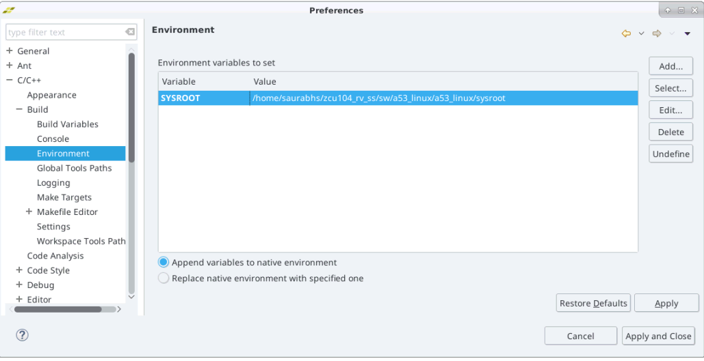
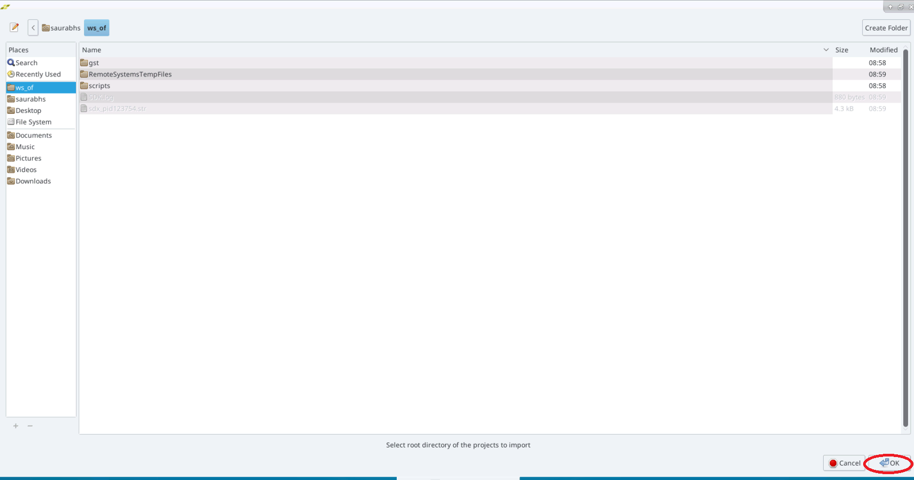
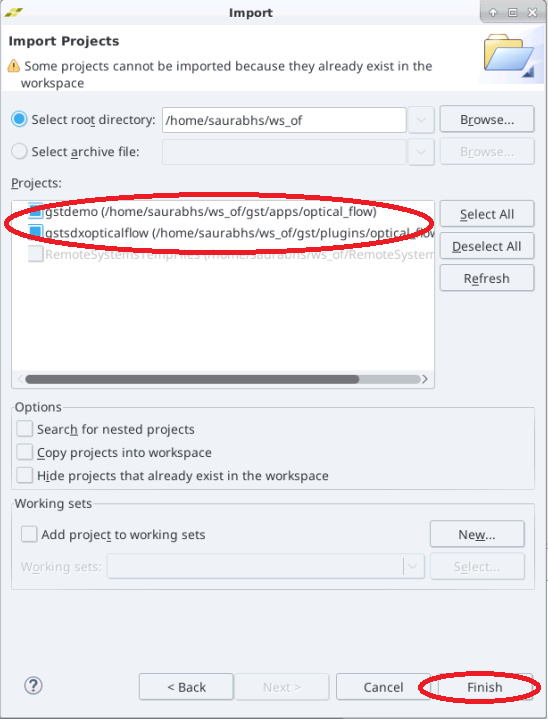
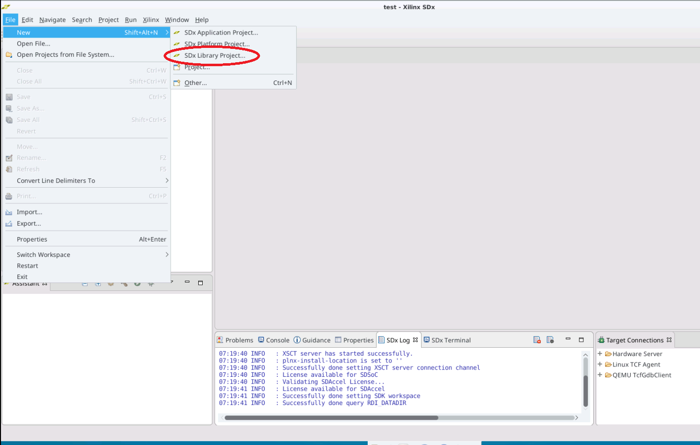
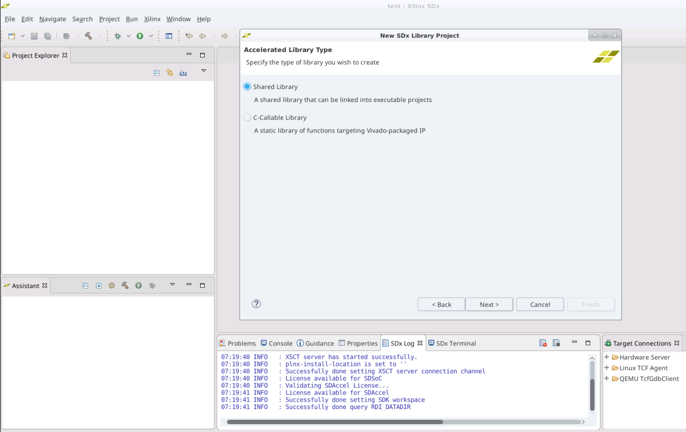
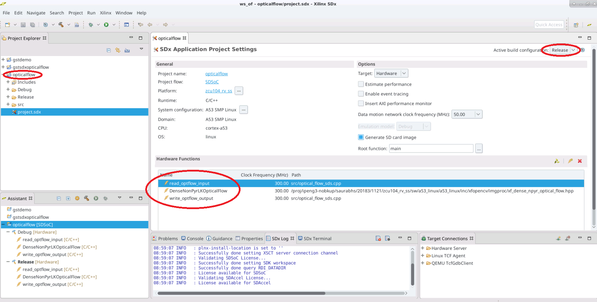
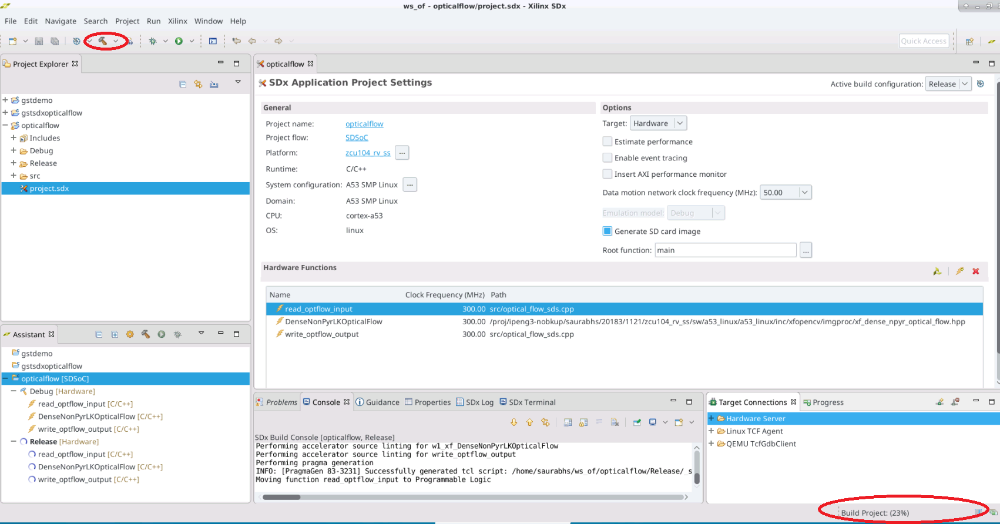
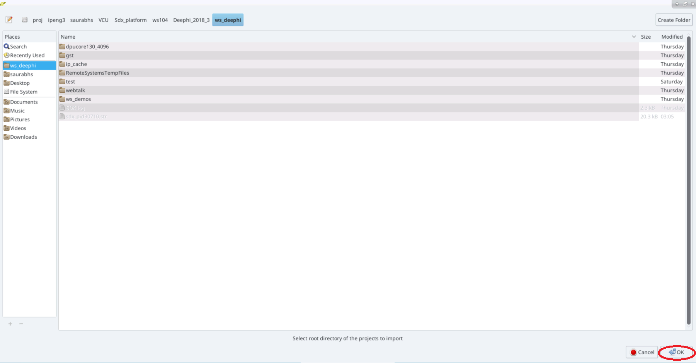
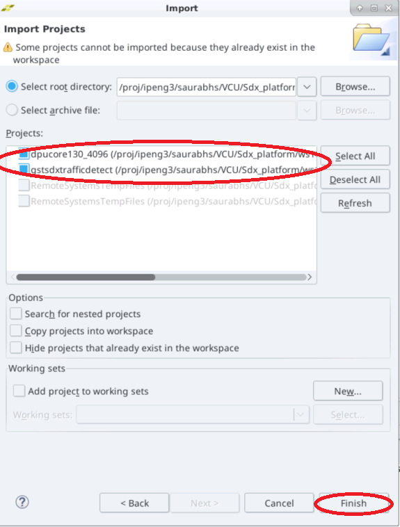
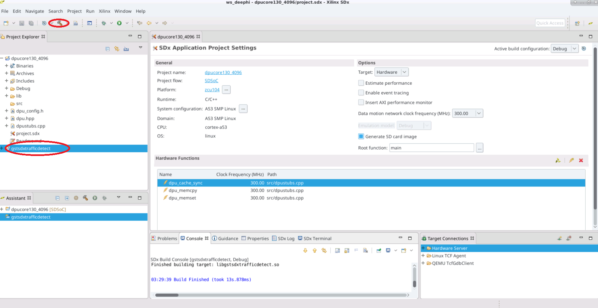

<p align="right">
            別の言語で表示: <a href="../../Docs/tool-flow-tutorials.md">英語</a>    <table style="width:100%"><table style="width:100%">
  <tr>

<th width="100%" colspan="6"><h1>reVISION 入門ガイド 2018.3 (UG1265)</h1>
</th>

  </tr>
  <tr>
    <td width="17%" align="center"><a href="../README.md">1. はじめに</a></td>
    <td width="16%" align="center"><a href="overview.md">2. 概要</a></td>
    <td width="17%" align="center"><a href="software-tools-system-requirements.md">3. ソフトウェア ツールおよびシステム要件</a></td>
    <td width="17%" align="center"><a href="design-file-hierarchy.md">4. デザイン ファイルの階層</a></td>
</tr>
<tr>
    <td width="17%" align="center"><a href="operating-instructions.md">5. インストールおよび操作手順</a></td>
    <td width="16%" align="center">6. ツール フロー チュートリアル</td>
    <td width="17%" align="center"><a href="run-application.md">7. アプリケーションの実行</a></td>
    <td width="17%" align="center"><a href="platform-details.md">8. プラットフォームの詳細</a></td>    
  </tr>
<tr>
    <td width="17%" align="center" colspan="2"><a href="known-issues-limitations.md">9. 既知の問題および制限</a></td>
    <td width="16%" align="center" colspan="2"><a href="additional-references.md">10. その他のリソース</a></td>
</tr>
</table>

# 6. ツール フロー チュートリアル

SDx™ 開発環境バージョン 2018.3 がインストールされており、Linux または Windows ホスト コンピューターで動作している必要があります。このガイドでは、サンプル デザインをビルドする手順を示します。[ソフトウェア](software-tools-system-requirements.md#32-ソフトウェア)でプラットフォーム ファイルを解凍したディレクトリ パスを記録しておいてください。

このパスは、SDx でカスタム プラットフォームの場所を指定する際に必要です。`SYSROOT` 環境変数にプラットフォーム内のディレクトリを指定します。下に示す構文ではプラットフォーム ルート ディレクトリを `<platform>` で示しており、これを実際のローカル パスに置き換える必要があります。

* Linux: `export SYSROOT=<platform>/sw/a53_linux/a53_linux/sysroot/aarch64-xilinx-linux/`
* Windows: **[スタート]** → **[コントロール パネル]** → **[システム]** → **[詳細設定]** → **[環境変数]** をクリックします。環境変数 `SYSROOT` を作成し、値を `<platform>/sw/a53_linux/a53_linux/sysroot/aarch64-xilinx-linux/` に設定します。

SDx 環境で **[Window]** → **[Preferences]** をクリックし、**[C/C++]** → **[Build]** → **[Environment]** で `sysroot` を追加することもできます。



## 6.1. シングル センサーのフロー
シングル センサー プラットフォームには、よく使用されるプログラマブル ロジックでアクセラレーションされた OpenCV 関数のデモを示す 5 つのファイル I/O と 3 つのライブ I/O デザイン例が含まれています。4 つ目のライブ I/O 例は、3 つのライブ I/O デザインを 1 つのデザインにまとめて、3 つのアクセラレーション関数を FPGA に配置して並列実行する方法を示します。

このリリースの reVISION では、ライブ I/O サンプル デザインは GStreamer に基づいています。[GStreamer](https://gstreamer.freedesktop.org/) を参照してください。オープン ソース GStreamer フレームワークのコードが reVISION プラットフォームに含まれており、デザイン例は GStreamer プラグインとしてビルドされます。テスト アプリケーションのコードも提供されており、プラグインを使用してビデオ パイプラインをセットアップして実行するアプリケーションをコンパイルできます。パイプラインは、`gst-launch-1.0` ユーティリティを使用して実行するか、Gstreamer ライブラリに対してコンパイルされた独自のアプリケーションにより実行できます。各プラットフォーム サンプル用に `gstdemo` という名前のテスト アプリケーションの例が提供されています。4 つのサンプル名は、`filter2d`、`optical_flow`、`stereo`、および `triple` です。各サンプルの `./workspaces/<name>/gst/apps/<name>` ディレクトリを確認してください。

GStreamer プラグインは共有ライブラリです。reVISION サンプル デザインの場合、GStreamer プラグインはリンクされた 2 つの部分で構成されています。これら 2 つの部分 top および bottom は、個別のプロジェクト ビルドで生成された個別の共有ライブラリです。top 部分は GStreamer プラグイン自体で、GStreamer フレームワークとインターフェイスするためのコードが含まれます。`./workspaces/<name>/gst/plugins/<name>` ディレクトリを確認してください。top 部分は、ハードウェアでアクセラレーションされる関数のコードを含む bottom 部分にリンクされています。bottom プロジェクトは、ハードウェア関数に使用されるプログラマブル ロジックを含む `BOOT.BIN` ファイルを生成します。これらは SDx プロジェクトです。`./samples/live_IO/<name>` ディレクトリを参照してください。

### 6.1.1. ライブ I/O オプティカル フロー サンプル アプリケーションのビルド

次の手順は、Linux または Windows バージョンのどちらの SDx を使用しても基本的に同じです。プラットフォームの一部として、4 つの `live_IO` サンプルに対して ` ./workspaces/...` フォルダー構造が既に設定されています。
```
├── workspaces
│   ├── ws_f2d
│   ├── ws_of
│   ├── ws_sv
│   ├── ws_triple

```

これらのワークスペースを、作業用のディレクトリにコピーします。プラットフォームで提供されている `optical_flow` ワークスペース エリアを見てください。`./gst/` にあるファイルは次のとおりです。`./opticalflow` ディレクトリは SDx プロジェクトで、下位アクセラレータ コードをビルドするためにユーザーが作成します。この `opticalflow` SDx プロジェクトは、`ws_of` ワークスペースのすぐ下に作成します。`./gst/` も `./ws_of` のすぐ下にあります。
```
├── ws_of
│   ├── gst
│   │   ├── apps
│   │   │   └── optical_flow
│   │   │       └── main.c
│   │   └── plugins
│   │       └── optical_flow
│   │          ├── gstsdxopticalflow.cpp
│   │          └── gstsdxopticalflow.h
│   └── opticalflow
│       └── src
│           ├── optical_flow_sds.cpp
│           └── optical_flow_sds.h

```

`./ws_of/` などワークスペース内では、このディレクトリ構造を保持する必要があります。これは、さまざまなプロジェクトが互いに依存関係にあり、インクルード ファイルおよびライブラリ ファイルへのパスが既知である必要があるからです。この構造を保持していれば、`./ws_of/` ツリーをすべてのサブディレクトリをそのまま別の場所にコピーしても問題ありません。

**:pushpin: 注記:**
>Linux を使用している場合は、ワークスペースを配置する場所に制限はありません。プラットフォームの下にある `./workspaces/` ディレクトリで直接作業することもできますし、元のエリアが変更されないように別の場所にコピーして作業することもできます。

>Windows を使用している場合は、ファイル パス名は 256 文字までに制限されます。ザイリンクス ビルド プロセスでは、ビルド プロセスを進めていくと、ディレクトリ構造が深くなり、パス名が長くなります。そのため、ワークスペースのパス名ができるだけ短くなるようにしてください (`C:\ws_of\...` など)。

#### 6.1.1.1. 既存の Gstreamer ワークスペースのインポート

1. SDx を起動してワークスペース `./ws_of` を選択します。`$SYSROOT` を設定したのと同じシェルで SDx 環境を実行してください。Welcome 画面を閉じ、**[File]** → **[Import]** → **[General]** → **[Existing Projects into Workspace]** → **[Next]** をクリックします。


2. [Import] ダイアログ ボックスで、[Select root directory] の右側の **[Browse]** ボタンをクリックします。


3.  デフォルトでは既にディレクトリ内にいるので、`./workspaces/ws_of` を指定します。**[OK]** をクリックします。



4. プロジェクトのリストが表示され、``gstdemo`` および ``gstopticalflow`` が選択されています。**[Finish]** をクリックします。



5. メイン ウィンドウに戻ると、[Project Explorer] ビューにインポートされたプロジェクトが表示されます。メニュー バーから **[File]** → **[New]** → **[SDx Library Project]** をクリックします。

#### 6.1.1.2. ライブラリ アプリケーション プロジェクトの作成


1. [Create a New SDx Library Project] ページで [Project name] に「`opticalflow`」と入力し、**[Next]** をクリックします。


2. [Accelerated Library Type] ページが開きます。**[Shared Library]** をオンにし、**[Next]** をクリックします。



#### 6.1.1.3. カスタム プラットフォームの追加
1. [Platform] ページで **[+]** をクリックし、reVISION プラットフォームを解凍した最上位ディレクトリ (`zcu104_rv_ss` など) を選択します。**[OK]** をクリックします。


2. [Platform] ページに新しいプラットフォームが表示されますが、選択されていません。選択して **[Next]** をクリックします。


3. 次のウィンドウで **[Next]** をクリックします。


#### 6.1.1.4. ライブ I/O サンプルの選択
[Templates] ページで [``live_IO``] の下の **[Dense Optical Flow]** を選択し、**[Finish]** をクリックします。


メイン ウィンドウに戻ると、[Project Explorer] ビューのインポートされた 4 つのプロジェクトの下に新しいプロジェクト `opticalflow` が表示されます。

#### 6.1.1.5. リリース ビルド コンフィギュレーションの選択
`opticalflow` プロジェクトの [Active build configuration] を **[Release]** に変更します。3 つのルーチンがハードウェア関数としてマークされていることに注目してください。



#### 6.1.1.6. プロジェクトのビルド

``opticalflow`` プロジェクトを右クリックして **[Build Project]** をクリックするか、ハンマー () アイコンをクリックしてビルドします。

開いた [Build Project] ダイアログ ボックスで **[Run in Background]** をクリックしてバックグランドで実行できます。これにより [Build Project] ダイアログ ボックスは閉じますが、GUI の右下に進捗状況バーが表示され、処理が実行中であることがわかります。GUI の下部中央にある **[Console]** ビューを選択し、ビルド プロセスの進捗状況を確認します。ビルド プロセスには、ホスト マシンの処理能力、Linux または Windows のどちらで実行しているか、およびデザインの複雑性によって、数時間かかることがあります。ほとんどの時間は、ハードウェアに配置するよう指定されたルーチンの処理に費やされます。[SDx Application Project Settings] の [Hardware Functions] ペインにリストされているものです。この例では、`read_optflow_input`、`DenseNonPyrLKOpticalFlow`、および `write_optflow_output` ルーチンがハードウェアにビルドされます。これらのルーチンの C コードを RTL に合成し、その RTL を Zynq® UltraScale+™ MPSoC のプログラマブル ロジックに配置配線するプロセスに最も時間がかかります。



ビルドが完了すると、次のファイルを含む `sd_card` ディレクトリが作成されるので、これらのファイルを SD カードにコピーします。
  * `cp ./workspaces/ws_of/opticalflow/Release/sd_card/BOOT.BIN <sdcard>`
  * `cp ./workspaces/ws_of/opticalflow/Release/sd_card/libopticalflow.so <sdcard>`
  * `cp ./workspaces/ws_of/opticalflow/Release/sd_card/image.ub <sdcard>`
  * `cp ./workspaces/ws_of/gst/plugins/optical_flow/Debug/libgstsdxopticalflow.so <sdcard>`
  * `cp ./workspaces/ws_of/gst/apps/optical_flow/Debug/gstdemo <sdcard>`

bottom 共有ライブラリがビルドされたので、top 部分をビルドし、bottom ライブラリにリンクします。`gstdemo` プロジェクトを選択してビルドします。これにより、両方の `gst--- ` プロジェクトがビルドされます。


### 6.1.2. Stereo、Filter2D、および Triple サンプル アプリケーションのビルド

Stereo、Filter2D、および Triple プロジェクトも、次の点を変更すれば、Optical Flow プロジェクトと同じ手順を使用して作成してビルドできます。

1. SDx 環境を起動し、適切なワークスペース ディレクトリ `./workspaces/ws_sv`、`./workspaces/ws_f2d`、または `./workspaces/ws_triple` を開きます。
2. [Templates] ページで **[Stereo Vision]**、**[Filter2D]**、または **[Optical Flow and Stereo]** を選択します。
3. その他すべての手順は同じです。

### 6.1.3. ファイル I/O サンプル アプリケーションのビルド

1. SDx 環境を起動して新しいワークスペース作成します。``$SYSROOT`` を設定したのと同じシェルで SDx を起動してください。

2. Welcome 画面を閉じ、メニュー バーから **[File]** → **[New]** → **[SDx Project]** をクリックします。**[Application Project]** を選択し、**[Next]** をクリックします。New SDx Project ウィザードが開きます。プロジェクトの名前 (バイラテラル フィルターを表す ``bil_fil`` など) を入力します。


3. [Use default location] をオンのままにして **[Next]** をクリックします。[Platform] ページが開きます。
4. プラットフォームを選択します。新しいワークスペースでこれを初めて実行する場合は、**[Add Custom Platform]** ([カスタム プラットフォームの追加](#6113-カスタム-プラットフォームの追加)を参照) をクリックしてカスタム プラットフォームを選択する必要があります。


5. カスタム プラットフォーム ([``zcu102_es2_rv_ss (custom)``] など) を選択し、**[Next]** をクリックします。[System Configuration] ページが開きます。


6. すべてをデフォルト設定のままにして **[Next]** をクリックします。[Templates] ページが開きます。テンプレートのリストから **[bilateral – File I/O]** を選択し、**[Finish]** をクリックします。


7. ウィザードが閉じ、SDx 統合設計環境 (IDE) の中央に [SDx Application Project Settings] が表示されます。このパネルの右下に C/C++ Indexer の進捗状況バーが表示されます。終了するのを待ちます。右上の [Active build configuration] が [Debug] に設定されています。**[Debug]** をクリックして **[Release]** に変更します。ウィンドウの表示は次のようになります。


8. [Project Explorer] ビューで ``bil_fil`` プロジェクトを右クリックし、**[Build Project]** をクリックします。または、ツールバーのハンマー () アイコンをクリックしても [Build Project] コマンドを実行できます。開いた [Build Project] ダイアログ ボックスで **[Run in Background]** をクリックしてバックグランドで実行できます。これにより [Build Project] ダイアログ ボックスは閉じますが、GUI の右下に進捗状況バーが表示され、処理が実行中であることがわかります。GUI の下部中央にある [Console] ビューを選択し、ビルド プロセスの進捗状況を確認します。ビルド プロセスには、ホスト マシンの処理能力、Linux または Windows のどちらで実行しているか、およびデザインの複雑性によって、数時間かかることがあります。ほとんどの時間は、ハードウェアに配置するよう指定されたルーチンの処理に費やされます。[SDx Application Project Settings] の左下の [Hardware Functions] ペインにリストされているものです。``bilateralFilter`` がハードウェアに移動する関数としてリストされています。

9. ビルドが完了すると、`.\<workspace>\bil_fil\Release\sd_card` ディレクトリに ``sd_card`` ディレクトリが作成されます。ボード上で関数を実行するには、ボードに SD カードを挿入して電源を投入します。
  * ``/media/card` ディレクトリに移動します。``cd /media/card`` コマンドを使用します。
  * ``./bil_fil.elf im0.jpg`` コマンドを使用して実行ファイルを実行します。
  * 正しく実行されると、ターミナルに次のように表示されます。
```

sigma_color: 7.72211 sigma_space: 0.901059 elapsed time 9133271 Minimum error in intensity = 0 Maximum error in intensity = 1 Percentage of pixels above error threshold = 0.00168789 Count: 35

```

10. ほかのファイル I/O サンプル (Harris コーナー検出、オプティカル フロー、ステレオ ブロック マッチング、および warpTransform) にも同じ操作を実行します。

## 6.2. 8 ストリーム VCU + CNN 交通量検出の例
8 ストリーム VCU + CNN プラットフォームの交通量検出の例は、プログラマブル ロジックの機械学習機能を示します。

この例は、[GStreamer](https://gstreamer.freedesktop.org/) に基づいています。オープン ソース GStreamer フレームワークのコードが reVISION プラットフォームに含まれており、デザイン例は GStreamer プラグインとしてビルドされます。テスト アプリケーションのコードも提供されており、プラグインを使用してビデオ パイプラインをセットアップして実行するアプリケーションをコンパイルできます。パイプラインは、`gst-launch-1.0` ユーティリティで実行できます。

reVISION サンプル デザインの場合、GStreamer プラグインはリンクされた 2 つの部分で構成されています。これら 2 つの部分 top および bottom は、個別のプロジェクト ビルドで生成された個別の共有ライブラリです。top 部分は GStreamer プラグイン自体で、GStreamer フレームワークとインターフェイスするためのコードが含まれます。`gstsdxtrafficdetect` ディレクトリを参照してください。top 部分は、ハードウェアでアクセラレーションされる関数のコードを含む bottom 部分にリンクされています。bottom プロジェクトは、ハードウェア関数に使用されるプログラマブル ロジックを含む `BOOT.BIN` ファイルを生成します。これらは C 呼び出し可能 SDx プロジェクトです。`dpucore130_4096` ディレクトリを参照してください。

### 6.2.1. 既存の Gstreamer および C 呼び出し可能プロジェクトのビルド
``ws_dpu`` ワークスペースを作業用のディレクトリにコピーします。このワークスペースのディレクトリ構造は次のとおりです。
```
ws_dpu
|-- dpucore130_4096
|-- gstsdxtrafficdetect
|-- include
`-- libs
```

- ``dpucore130_4096``  : DPU を含む C 呼び出し可能プロジェクト
- ``gstsdxtrafficdetect``: 交通量検出用の Gstreamer プラグイン プロジェクト
- ``include``: DNNDK ヘッダー ファイル
- ``libs``: DNNDK ライブラリ

このワークスペースに切り替えるか、現在のワークスペースにこれら 2 つのプロジェクトをインポートできます。プロジェクトをインポートする場合は、``include`` および ``libs`` フォルダーをワークスペースのルート パスにコピーしてください。``gstsdxtrafficdetect`` プロジェクトは、ワークスペースのルート パスを使用して DNNDK ヘッダーおよびライブラリを検索します。

#### 6.2.1.1. 既存の Gstreamer ワークスペースのインポート
1. SDx を起動してではワークスペースを選択します。`$SYSROOT` を設定したのと同じシェルで SDx 環境を実行するか、後で ``gstsdxtrafficdetect`` のプロパティ ページでこの環境変数を設定してください。

2. Welcome 画面を閉じ、**[File]** → **[Import]** → **[General]** → **[Existing Projects into Workspacel]** → **[Next]** をクリックします。


3. [Import] ダイアログ ボックスで、[Select root directory] の右側の **[Browse]** ボタンをクリックします。


4. デフォルトでは既にディレクトリ内にいるので、`ws_dpu` を指定します。**[OK]** をクリックします。



5. プロジェクトのリストが表示され、``dpucore130_4096`` および ``gstsdxtrafficdetect`` が選択されています。**[Finish]** をクリックします。



6. メイン ウィンドウに戻ると、[Project Explorer] ビューにインポートされた 2 つのプロジェクトが表示されます。  メニュー バーから **[File]** → **[New]** → **[SDx Library Project]** をクリックします。

#### 6.2.1.2. カスタム プラットフォームの追加

シングル センサーと同じ手順 ([カスタム プラットフォームの追加](#6113-カスタム-プラットフォームの追加)を参照) を使用し、8 ストリーム VCU + CNN プラットフォームを選択します。

#### 6.2.1.3. プロジェクトのビルド

右クリックして **[Build Project]** をクリックするか、ハンマー () アイコンをクリックして、`dpucore130_4096` プロジェクトをビルドします。

開いた [Build Project] ダイアログ ボックスで **[Run in Background]** をクリックしてバックグランドで実行できます。これにより [Build Project] ダイアログ ボックスは閉じますが、GUI の右下に進捗状況バーが表示され、処理が実行中であることがわかります。GUI の下部中央にある **[Console]** ビューを選択し、ビルド プロセスの進捗状況を確認します。ビルド プロセスには、ホスト マシンの処理能力、Linux または Windows のどちらで実行しているか、およびデザインの複雑性によって、数時間かかることがあります。ほとんどの時間は、ハードウェアに配置するよう指定されたルーチンの処理に費やされます。[SDx Project Settings] の左下の [Hardware Functions] ペインにリストされているものです。この例では、`dpu_cache_sync`、`dpu_memcpy`、および `dpu_memset` ルーチンがハードウェアにビルドされます。これらのルーチンの C コードを RTL に合成し、その RTL を Zynq UltraScale+ MPSoC のプログラマブル ロジックに配置配線するプロセスに最も時間がかかります。


ビルドが完了すると、次のファイルを含む `sd_card` ディレクトリが作成されるので、これらのファイルを SD カードにコピーします。


  * `cp ./dpucore130_4096/Debug/sd_card/BOOT.BIN <sdcard>`
  * `cp ./dpucore130_4096/Debug/sd_card/libdpucore130_4096.so <sdcard>/libdpucore.so`
  * `cp ./dpucore130_4096/Debug/sd_card/image.ub <sdcard>`
  * `cp ./dpucore130_4096/Debug/sd_card/uEnv.txt <sdcard>`

  **:pushpin: 注記:** ``libdpucore130_4096.so`` を使用する場合は、``libdpucore.so`` という名前に変更するか、これをポイントするソフト リンクを作成してください。

DPU C 呼び出し可能ワークスペースがビルドされたので、Gstreamer プラグインをビルドし、ワークスペースにリンクします。`gstsdxtrafficdetect` プロジェクトを選択してビルドします。ビルドが完了すると、プラグイン ``libgstsdxtrafficdetect.so`` ディレクトリが作成されます。




:arrow_forward:**次のトピック:** [7. アプリケーションの実行](run-application.md)

:arrow_backward:**前のトピック:** [5. インストールおよび操作手順](operating-instructions.md)
<hr/>
<p align="center"><sup>Copyright&copy; 2018-2019 Xilinx</sup></p>
