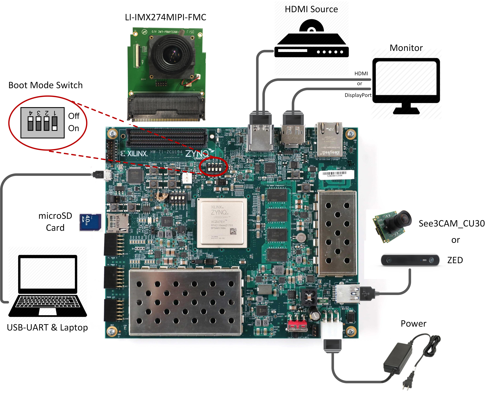

            Read this page in other languages:<a href="../Japanese-master/operating-instructions.md">日本語</a>    <table style="width:100%"><table style="width:100%">
  <tr>

<th width="100%" colspan="6"><h1>reVISION Getting Started Guide 2018.2</h1>
</th>

  </tr>
  <tr>
    <td width="17%" align="center"><a href="README.md">1. Introduction</a></td>
    <td width="16%" align="center"><a href="overview.md">2. Overview</a></td>
    <td width="17%" align="center"><a href="software-tools-system-requirements.md">3. Software Tools and System Requirements</a></td>
    <td width="17%" align="center"><a href="design-file-hierarchy.md">4. Design File Hierarchy</a></td>
</tr>
<tr>
    <td width="17%" align="center">5. Installation and Operating Instructions</td>
    <td width="16%" align="center"><a href="tool-flow-tutorials.md">6. Tool Flow Tutorials</a></td>
    <td width="17%" align="center"><a href="run-application.md">7. Run the Application</a></td>
    <td width="17%" align="center"><a href="platform-details.md">8. Platform Details</a></td>    
  </tr>
<tr>
    <td width="17%" align="center" colspan="2"><a href="known-issues-limitations.md">9. Known Issues and Limitations</a></td>
    <td width="16%" align="center" colspan="2"><a href="additional-references.md">10. Additional References</a></td>
</tr>
</table>

# 5 Installation and Operating Instructions

## 5.1 Board Setup

**Required:**
* Connect power supply to the 12V power connector.
* Display
  * Connect a DisplayPort cable to DisplayPort connector on the board; connect the other end to a monitor **OR**
  * Connect an HDMI cable to HDMI Output (*top* HDMI connector) on the board; connect the other end to a monitor.

  **:pushpin: NOTE** Certain monitors have multiple HDMI ports supporting different HDMI standards. Make sure you choose an HDMI 2.0 capable port (if available) for 4k60 performance.

  **:pushpin: NOTE** Make sure you only connect either DisplayPort or HDMI Output on the board, not both, otherwise the design might malfunction.

* Connect micro-USB cable to the USB-UART connector; use the following settings for your terminal emulator:
  * Baud Rate: 115200
  * Data: 8 bit
  * Parity: None
  * Stop: 1 bit
  * Flow Control: None

* Insert SD card (FAT formatted) with pre-built image copied from one of the following directories:
  * optical_flow: `sd_card/optical_flow`
  * stereo: `sd_card/stereo`
  * filter2d: `sd_card/filter2d`
  * triple: `sd_card/triple`

**Optional:**
* Connect an HDMI cable to HDMI Input (*bottom* HDMI connector) on the board; connect the other end to an HDMI source
* Connect the See3CAM_CU30 or ZED USB camera to the USB3 micro-AB connector via the Xilinx USB3 micro-B adapter
* Connect the LI-IMX274MIPI-FMC module to the FMC connector on the board (use the HPC0 connector on the ZCU102)

  **:pushpin: NOTE** Vadj needs to be set to **1.2V** for correct operation of the daughter card. If the FMC card does not function, please follow the instructions explained in Answer Record [AR67308](https://www.xilinx.com/support/answers/67308.html) for rev 1.0 and beyond to check and/or set Vadj.

**ZCU102 Jumpers & Switches:**
* Set boot mode to SD card
  * SW6[4:1]: **off,off,off, on**
* Configure USB jumpers for host mode. The drawing shows the area on the board near the USB connector.
  * J110: **2-3**
  * J109: **1-2**
  * J112: **2-3**
  * J7: **1-2**
  * J113: **1-2**

  

**ZCU104 Jumpers & Switches:**
* Set boot mode to SD card
  * SW6[4:1]: **off,off,off, on**

  

## 5.2 Extract the design zip files

Download and unzip the reference design zip file matching your silicon version (see Section 3.2).
* For Linux, use the **unzip** utlity.
* For Windows, make sure that the reference design zip file is unzipped in a directory path which contains no spaces. Use the **7zip** utility and follow the steps below. If you need 7zip, get it here [7zip](http://www.7-zip.org/).

Once the reference design zip file is unzipped, navigate to the `petalinux` directory and unzip the file `sdk.zip` which contains the sysroot.

**:pushpin: NOTE** When prompted to confirm file replace, select ‘Auto Rename’ (Windows only)

  

:arrow_forward:**Next Topic:**  [6. Tool Flow Tutorials](tool-flow-tutorials.md)

:arrow_backward:**Previous Topic:**  [4. Design File Hierarchy](design-file-hierarchy.md)

Copyright&copy; 2018 Xilinx

