<p align="right">
            Read this page in other languages:<a href="../Japanese-master/tool-flow-tutorials.md">日本語</a>    <table style="width:100%"><table style="width:100%">
  <tr>

<th width="100%" colspan="6"><h1>reVISION Getting Started Guide 2018.2</h1>
</th>

  </tr>
  <tr>
    <td width="17%" align="center"><a href="README.md">1. Introduction</a></td>
    <td width="16%" align="center"><a href="overview.md">2. Overview</a></td>
    <td width="17%" align="center"><a href="software-tools-system-requirements.md">3. Software Tools and System Requirements</a></td>
    <td width="17%" align="center"><a href="design-file-hierarchy.md">4. Design File Hierarchy</a></td>
</tr>
<tr>
    <td width="17%" align="center"><a href="operating-instructions.md">5. Installation and Operating Instructions</a></td>
    <td width="16%" align="center">6. Tool Flow Tutorials</td>
    <td width="17%" align="center"><a href="run-application.md">7. Run the Application</a></td>
    <td width="17%" align="center"><a href="platform-details.md">8. Platform Details</a></td>    
  </tr>
<tr>
    <td width="17%" align="center" colspan="2"><a href="known-issues-limitations.md">9. Known Issues and Limitations</a></td>
    <td width="16%" align="center" colspan="2"><a href="additional-references.md">10. Additional References</a></td>
</tr>
</table>

# 6 Tool Flow Tutorials

The SDx Development Environment, version 2018.2, must be installed and working on your host computer, either the Linux or the Windows version.

This guide will walk you through the process of building the sample designs. In step [3.2 Software](software-tools-system-requirements.md#32-software ), you unzipped your platform files, and noted the exact directory paths.

The path to the extracted platform will be needed to tell SDx where your custom platform resides. You need to set the SYSROOT environment variable to point to a directory inside the platform. The platform root directory is abbreviated to `<platform>` below and needs to be replaced with your local path.

**:information_source: IMPORTANT:** Before starting SDx, set the **SYSROOT environment variable** to point to the Linux root file system, i.e the sysroot top directory you just unzipped in step [5.2 Extract the design zip files](operating-instructions.md#52-extract-the-design-zip-files).

```
Linux: export SYSROOT=<platform>/petalinux/sdk/sysroots/aarch64-xilinx-linux
Windows: Start->Control Panel->System->Advanced->Environment Variables Create environment variable SYSROOT with value <platform>/petalinux/sdk/sysroots/aarch64-xilinx-linux
```

You can also set SYSROOT for all projects in your SDx Environment by opening the Menu 'Window' → 'Preferences' and adding 'sysroot' variable to 'C/C++' → 'Build' → 'Environment'.

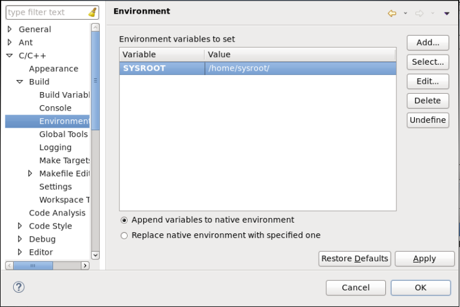

The platform ships with five file IO and three live IO design examples demonstrating popular OpenCV functions accelerated on the programmable logic. A fourth live I/O example shows how to combine the other three live I/O designs into one design, allowing the three accelerated functions to reside and run in parallel in the FPGA.

With this release of reVISION the live IO sample design examples are based on GStreamer. See [GStreamer](https://gstreamer.freedesktop.org/) The open source GStreamer framework code is included with the reVISION platform, and design examples are built as GStreamer plugins. Code for test applications is provided as well, allowing you to compile apps that will set up and run video pipelines using the plugins. Pipelines may be run using the `gst-launch-1.0` utility, or by your own app compiled against the gstreamer libraries. An example test app called gstdemo is provided for each of the platform samples. The four sample `<names>` are `filter2d`, `optical_flow`, `stereo`, and `triple`. See the `./workspaces/<name>/gst/apps/<name>`. directory for each sample.

A GStreamer plugin is a shared library. In the case of the reVISION sample designs, the GStreamer plugin consists of two linked parts. These "top" and "bottom" parts are separate shared libraries produced by separate project builds. The top part is the GStreamer plugin itself, containing the code for interfacing with the GStreamer framework. See the `./workspaces/<name>/gst/plugins/<name>` directory.
The top part links with the bottom part which contains the code for the HW accelerated function(s). This bottom project generates the BOOT.BIN file containing the programmable logic used for the HW function(s). These are SDx projects: See the `./samples/live_IO/<name>` directory.

## 6.1 Build the Live_IO Optical Flow sample application

The following steps are virtually identical whether you are running the Linux or Windows version of SDx.

There is a` ./workspaces/...` folder structure already set up for the four live_IO samples as part of the platform :
```
├── workspaces
│   ├── ws_f2d
│   ├── ws_of
│   ├── ws_sv
│   ├── ws_triple

```

You should copy these workspaces to the directory where you want to work. Look at the optical_flow workspace area supplied with the platform. All files under `./gst/` are supplied exactly as shown. The `./opticalflow` directory is the SDx project you will create to build the low level accelerator code - note that you'll create this 'opticalflow' SDx project directly under the` ws_of` workspace. Note that `./gst/` is also directly under `./ws_of` :
```
├── ws_of
│   ├── gst
│   │   ├── allocators
│   │   │   ├── gstsdxallocator.c
│   │   │   └── gstsdxallocator.h
│   │   ├── apps
│   │   │   └── optical_flow
│   │   │       └── main.c
│   │   ├── base
│   │   │   ├── gstsdxbase.c
│   │   │   └── gstsdxbase.h
│   │   └── plugins
│   │       └── optical_flow
│   │          ├── gstsdxopticalflow.cpp
│   │          └── gstsdxopticalflow.h
│   └── opticalflow
│       └── src
│           ├── optical_flow_sds.cpp
│           └── optical_flow_sds.h

```

For a given workspace, such as `./ws_of/`, the arrangement of these subdirectories must be preserved. This is because the various projects depend on each other in that they need to know the paths to each other's include files and library files. As long as you keep this structure, you're OK - i.e. you may copy the `./ws_of/` tree with everything just as shown, and put it anywhere you want to work.

**:pushpin: NOTE**
>If you are working on Linux, there is no restriction on where you put these workspaces. Some people may want to work directly in the` ./workspaces/` directory under the platform itself, and others may want to copy it elsewhere so that the original area remains untouched.

>**If you are working on Windows there is a restriction**, i.e. file path lengths are restricted to 256 characters. The Xilinx build process creates some very deep directory structures with long names as it goes through the build process. You are advised, therefore, to keep the path to the workspace as short as possible. E.g. `C:\ws_of\...`

### 6.1.1 Import existing gstreamer workspaces
* Start SDx and select workspace `./ws_of`. Make sure you use the same shell to run SDx as the one where you have set $SYSROOT.
* Close the Welcome screen and select 'File'→'Import'→'General'→'Existing Projects into Workspacel'→'Next'.

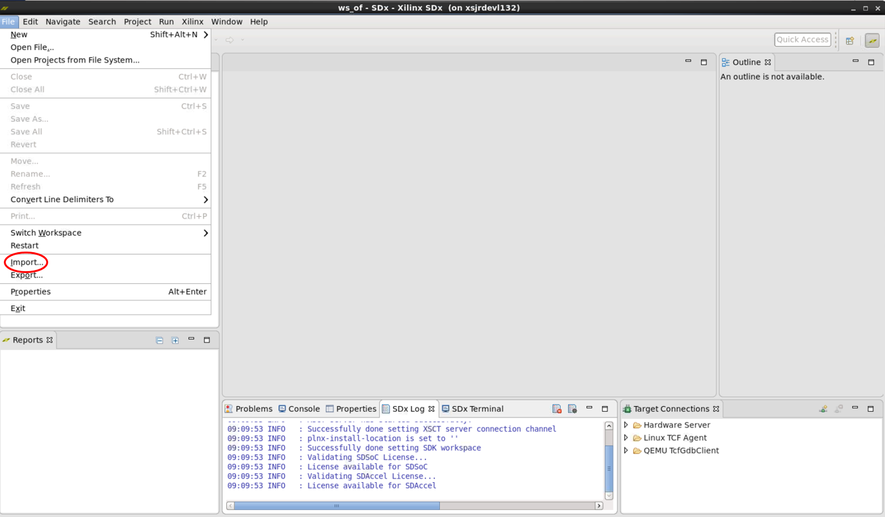


* In the Import dialog, to the right of 'Select root directory', click 'Browse'.


* By default you're already in the directory you want `./workspaces/ws_of`, just click 'OK'.


* You should see a list of projects, with gstdemo, gstsdxallocator, gstsdxbase, and gstopticalflow selected, click 'Finish'.


* Back at the main window, the four imported projects appear in the Project Explorer pane. Now select 'File'→'New'→'SDx Project'... from the menu bar.

### 6.1.2 Create application project
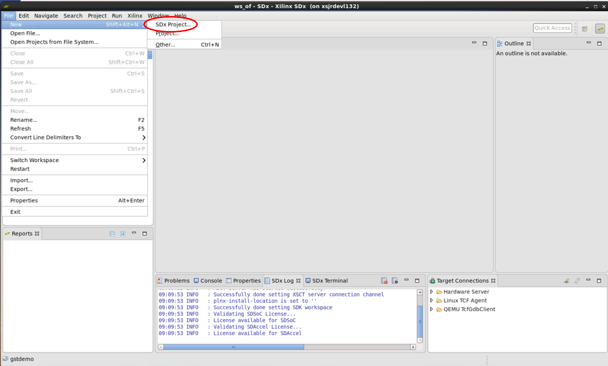

* This brings up the Project Type dialog box, with Application Project selected, click 'Next'.


* In the 'Create a New SDx Project' dialog, enter Project name 'opticalflow', click 'Next'.

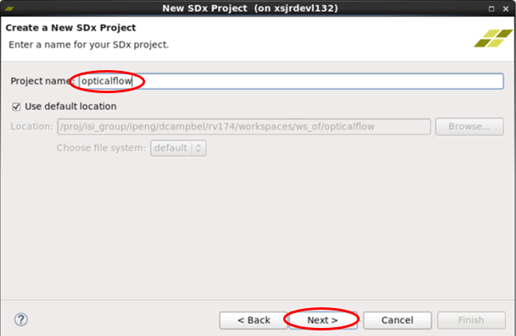

### 6.1.3 Add custom platform
* In the Platform dialog, click 'Add Custom Platform', find your way to the top directory where you unzipped the reVISION platform, called, for example, zcu102_rv_ss. Click 'OK'.


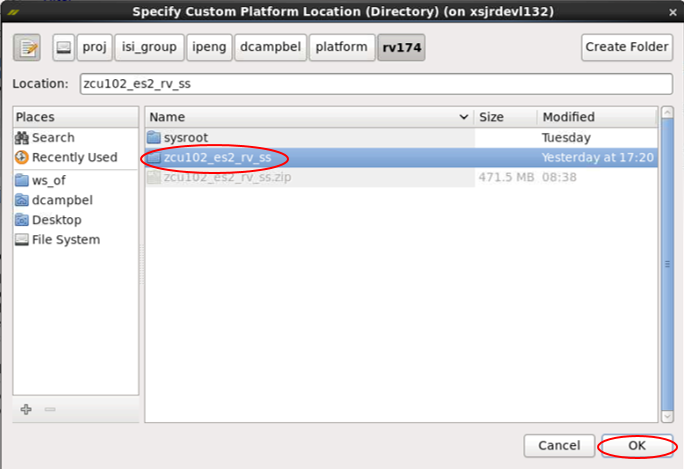

* Back in the Platform dialog, the new platform appears in the list, but is not selected. Select it, then click 'Next'.


### 6.1.4 Opt shared library
* In the System configuration dialog, under Output type, select 'Shared Library', click 'Next'.

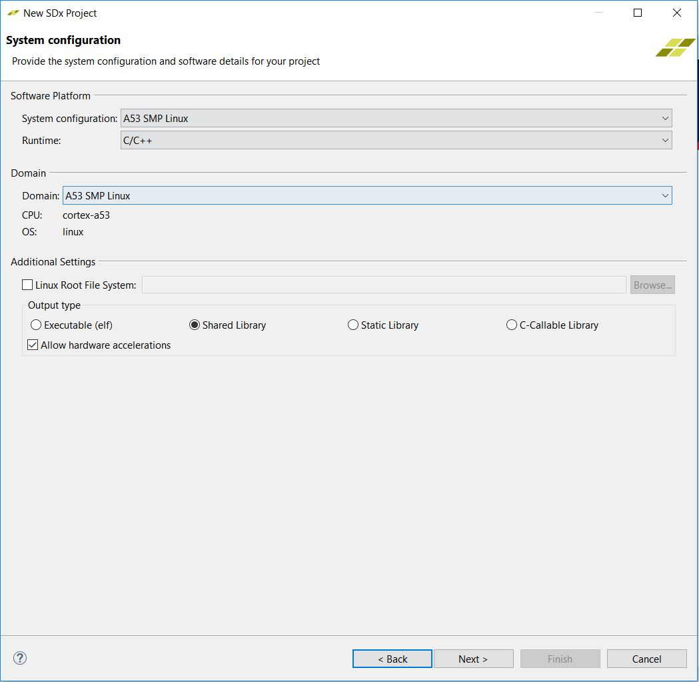

### 6.1.5 Select live I/O sample
* In the Templates dialog, under live_IO select Dense Optical Flow and click 'Finish'.


* Back again at the main window, the new project 'opticalflow' appears under the four imported projects appear in the Project Explorer pane.

### 6.1.6 Select release build configuration
* Switch the 'Active Build Configuration' for the opticalflow project to Release. Note that three routines are marked as Hardware Functions.

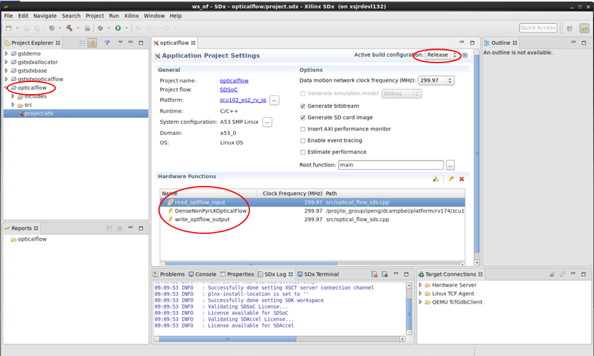

### 6.1.7 Building Project

* Build the opticalflow project - do this by clicking right and choosing Build Project, or by clicking the 'hammer' icon.
* In the small Build Project dialog that opens, you may hit the "Run in Background" button. That causes the small dialog box to disappear, though you can still see a progress icon in the lower right part of the GUI, showing that work is in progress. Select the Console tab in the lower central pane of the GUI to observe the steps of the build process as it progresses. The build process may take tens of minutes, up to several hours, depending on the power of your host machine, whether you are running on Linux or Windows, and of course the complexity of your design. By far the most time is spent processing the routines that have been tagged for realization in hardware - note the "HW functions" window in the lower part of the SDx Project Settings pane. In our example above, the routines read_optflow_input, DenseNonPyrLKOpticalFlow, and write_optflow_output are tagged to be built in hardware. The synthesis of the C code found in these routines into RTL, and the Placement and Routing of that RTL into the programmable logic in the Zynq MPSoC, are the steps that take most of the time.

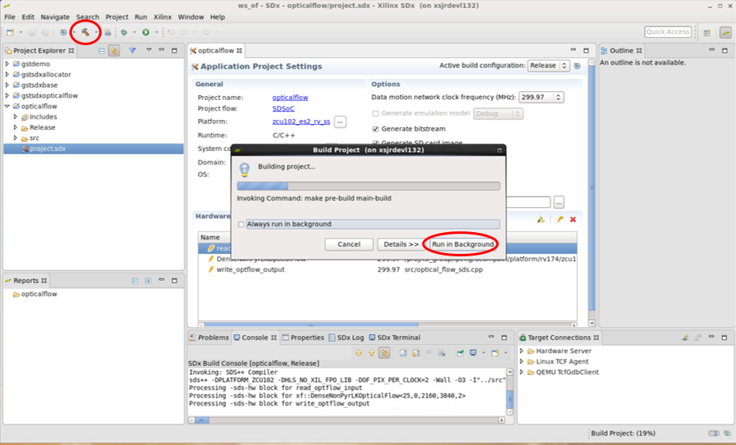

* Once the Build completes, you will find an sd_card directory has been created containing these files you'll need to transfer to your SD card.
* Note that a few of the images must be copied, creating lib and gstreamer-1.0 directory in your sdcard.
  * `cp ./workspaces/ws_of/opticalflow/Release/sd_card/BOOT.BIN <sdcard>`
  * `cp ./workspaces/ws_of/opticalflow/Release/sd_card/libopticalflow.so <sdcard>/lib/`
  * `cp ./workspaces/ws_of/opticalflow/Release/sd_card/image.ub <sdcard>`
  * `cp ./workspaces/ws_of/opticalflow/Release/sd_card/video_cmd <sdcard>`
  * `cp ./workspaces/ws_of/gst/allocators/Debug/libgstsdxallocator.so <sdcard>/lib/`
  * `cp ./workspaces/ws_of/gst/base/Debug/libgstsdxbase.so <sdcard>/lib/`
  * `cp ./workspaces/ws_of/gst/plugins/optical_flow/Debug/libgstsdxopticalflow.so <sdcard>/gstreamer-1.0/`
  * `cp ./workspaces/ws_of/gst/apps/optical_flow/Debug/gstdemo <sdcard>`
* Now that the "bottom" shared library is built, you may build the "top" part, that will be linked with the bottom library. Now select the gstdemo project, and build it. Doing this will build all four of the gst--- projects.

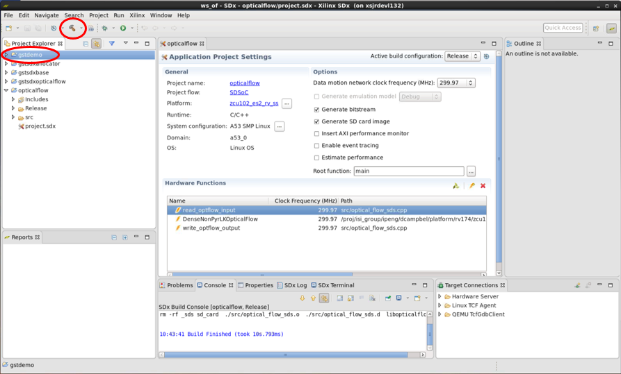

## 6.2 Build the Stereo, the Filter2D, and the Triple sample applications

* The Stereo, Filter2D, and the Triple project may be created and built in the same way just explained for the Optical Flow project. The steps are very similar.
* Launch SDx, starting in the appropriate workspace directory: `./workspaces/ws_sv`, `./workspaces/ws_f2d`, or `./workspaces/ws_triple`, respectively.
* In the Templates dialog, select 'Stereo Vision', 'Filter2D', or 'Optical Flow and Stereo', respectively.
* All the other steps are analogous.

## 6.3 Build the File IO sample applications

* Start SDx and create a new workspace. Make sure you use the same shell to run SDx as the one where you have set $SYSROOT.
* Close the Welcome screen and select 'File' → 'New' → 'SDx Project'... from the menu bar. Select Application Project and click 'Next'. This brings up the Create a New SDx Project dialog box. Enter a name for project (e.g. “bil_fil” which stands for bilateral filter).


* Leave the "Use default location" box checked, hit Next>, this opens the "Platform" page.
* Select the platform. The very first time you do this for a new workspace, you must hit Add Custom Platform (as explained in [6.1.3 Add custom platform](#613-add-custom-platform) and select the custom platform.

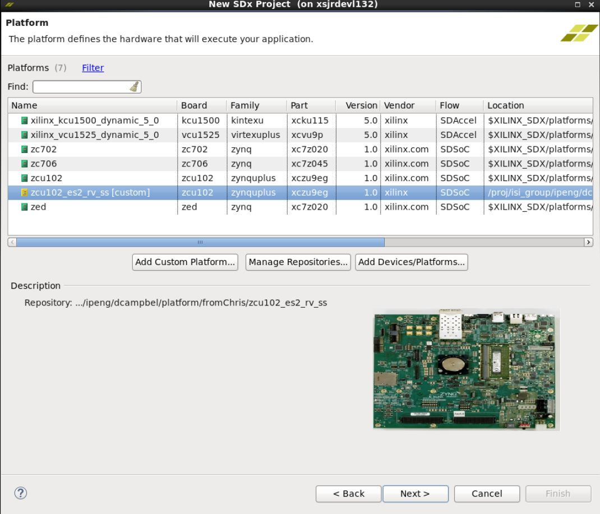

* Select your custom platform e.g. "zcu102_es2_rv_ss (custom)", hit 'Next', this opens the "System configuration" page.

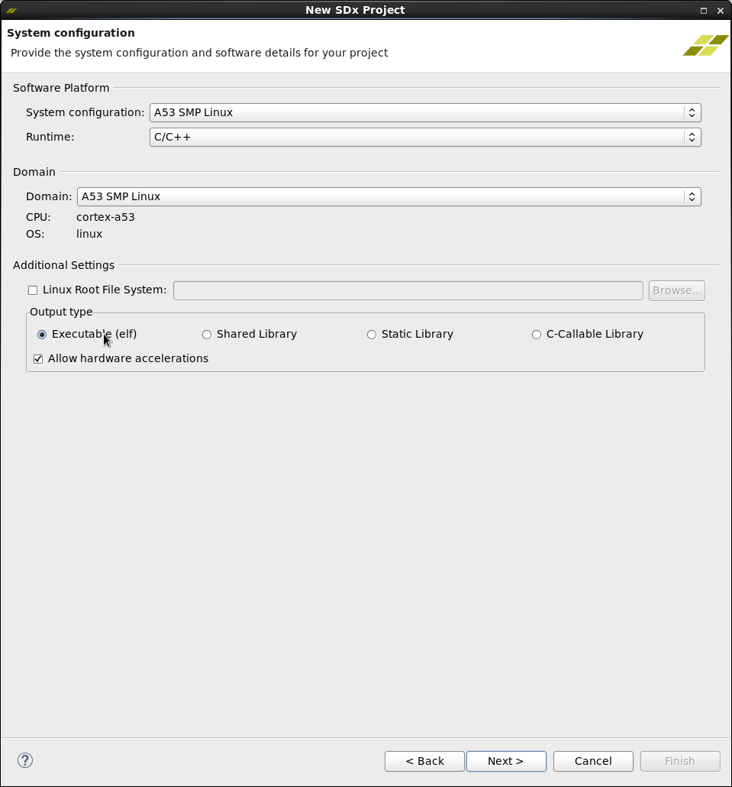

* Leave everything as is, hit Next>, this opens the "Templates" page.
* Select “bilateral – File I/O” from the set of templates and click on “Finish”.


* The dialog box closes, and you now see the SDx Project Settings pane in the center of the SDx GUI. Notice the progress bar in the lower right border of the pane, saying "C/C++ Indexer" - wait a few moments for this to finish. Locate the "Active build configuration:" in the upper right corner of the pane, which says "Debug" - click it and select Release. Your window should now look something like this:

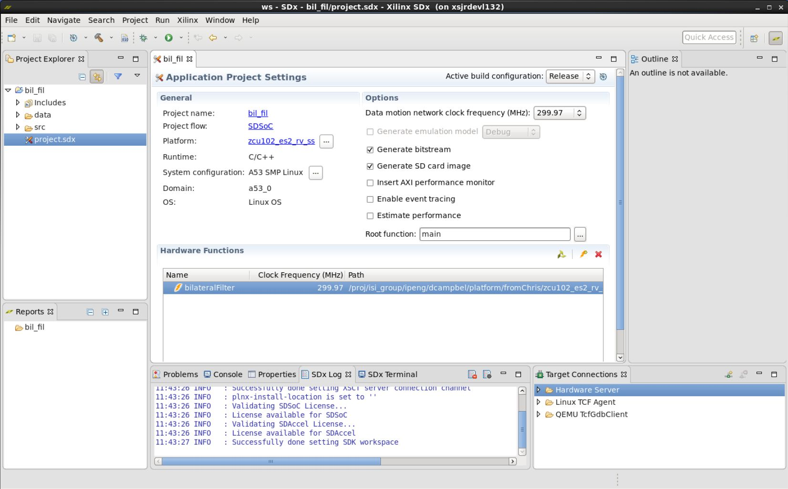

* In the left hand "Project Explorer" pane, select the bil_fil project, click right on it, then select Build Project. The "Hammer" icon in the menu bar also performs "Build Project". In the small Build Project dialog that opens, you may hit the "Run in Background" button. That causes the small dialog box to disappear, though you can still see a progress icon in the lower right part of the GUI, showing that work is in progress. Select the Console tab in the lower central pane of the GUI to observe the steps of the build process as it progresses. The build process may take tens of minutes, up to several hours, depending on the power of your host machine, whether you are running on Linux or Windows, and of course the complexity of your design. By far the most time is spent processing the routines that have been tagged for realization in hardware - note the "HW functions" window in the lower part of the SDx Project Settings pane. “bilateralFilter” is listed as a function tagged to be moved to hardware.
* Once the Build completes, you will find an sd_card directory has been created at
  * `.\<workspace>\bil_fil\Release\sd_card`
* In order to run the function on the board, mount the SD card on the board and power it on.
* At the prompt, go to the directory “/media/card”. Use the following command: cd /media/card
* Run the executable using the following command: ./bil_fil.elf im0.jpg
* If the run is successful, the following text appears at the terminal:
```

sigma_color: 7.72211 sigma_space: 0.901059 elapsed time 9133271 Minimum error in intensity = 0 Maximum error in intensity = 1 Percentage of pixels above error threshold = 0.00168789 Count: 35

```

* Follow the same procedure for other file I/O samples – Harris corner detection, optical flow, stereo block matching and warpTransform.


<hr/>

:arrow_forward:**Next Topic:**  [7. Run the Application](run-application.md)

:arrow_backward:**Previous Topic:**  [5. Installation and Operating Instructions](operating-instructions.md)
<hr/>
<p align="center"><sup>Copyright&copy; 2018 Xilinx</sup></p>
